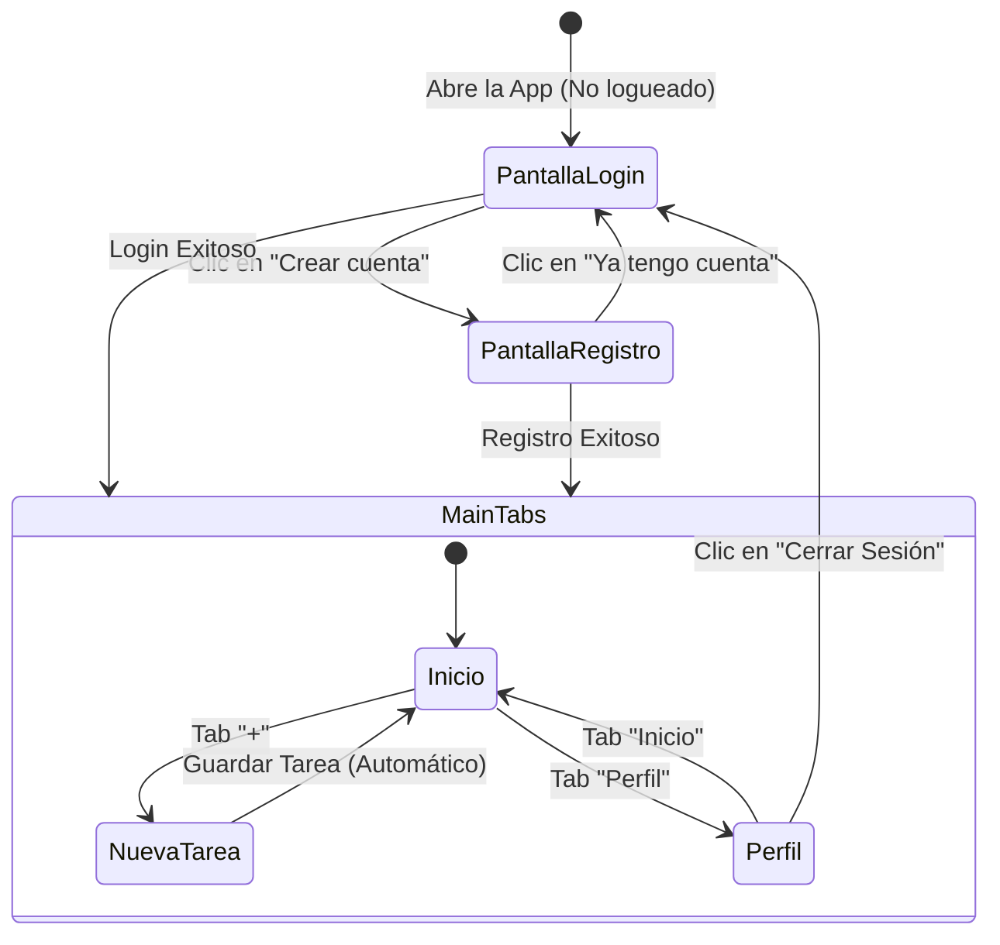
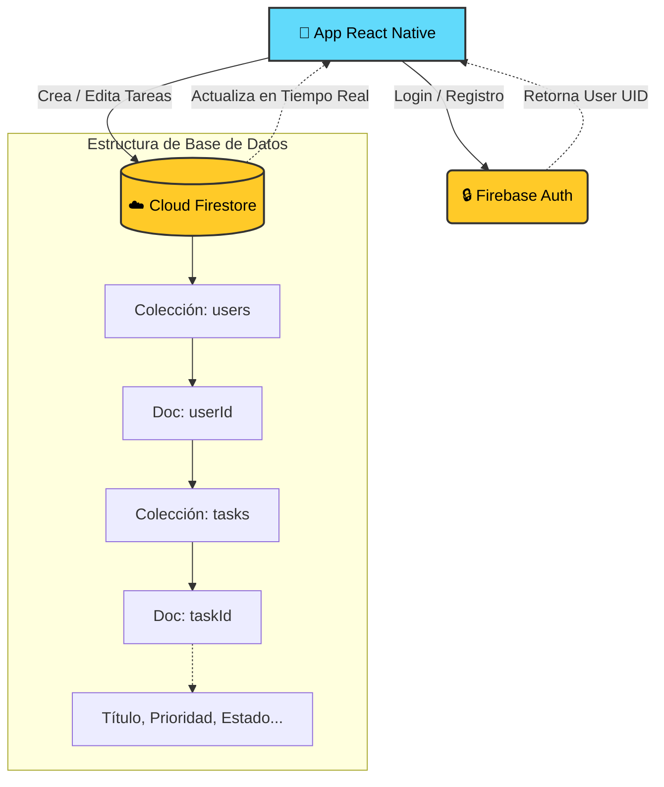

# 📱 SmartTimeManager — OrganizadorApp

**Sistema adaptativo de organización personal con señales visuales**

App de gestión de tiempo inteligente que organiza automáticamente el día del usuario en base a tareas introducidas, mostrando notificaciones visuales (colores en barra superior) para indicar estado y prioridades.

---

## 🎯 Problema que resuelve

Dificultad para gestionar el tiempo y priorizar tareas sin sobrecarga cognitiva.

## 👥 Usuario objetivo

Profesionales, estudiantes y perfiles con alta carga de tareas.

---

## ✨ Funcionalidades implementadas

### ✅ Tarea 1: Setup React Native & Arquitectura
- Proyecto inicializado con `npx @react-native-community/cli init`
- React Native **0.85.2** con TypeScript
- Estructura de carpetas organizada:
  ```
  src/
  ├── components/     # Componentes reutilizables (CustomButton, CustomInput, TaskCard)
  ├── screens/        # Pantallas completas
  │   ├── Auth/       # LoginScreen, RegisterScreen
  │   └── Main/       # HomeScreen, CreateTaskScreen, ProfileScreen
  ├── navigation/     # Navegadores (AppNavigator, AuthNavigator, MainTabNavigator)
  ├── services/       # Llamadas a Firebase (authService, taskService)
  ├── store/          # Estado global (AuthContext)
  └── utils/          # Utilidades (colors, priorities)
  ```

### ✅ Tarea 2: Navegación Principal (Bottom Tabs)
- Barra de navegación inferior con 3 pestañas:
  - 🏠 **Inicio** — Lista de tareas en tiempo real
  - ➕ **Nueva Tarea** — Formulario de creación
  - 👤 **Perfil** — Info del usuario y cerrar sesión
- `AppNavigator` que alterna entre flujo de auth y tabs según estado de login
- El `TabNavigator` solo se muestra si el usuario está logueado

### ✅ Tarea 3: UI de Creación de Tareas
- Formulario completo con:
  - `CustomInput` para **Título** y **Descripción**
  - Selector de **prioridad** con pills de colores (Urgente / Alta / Media / Baja)
  - `DateTimePicker` para seleccionar **deadline** (fecha y hora)
  - Botón **"Guardar Tarea"** grande
- Validación de campos con mensajes de error
- Todos los campos gestionados con `useState`

### ✅ Tarea 4: Lógica Backend — Creación de Tareas (Firestore)
- Servicio `taskService.ts` con función `addTask(userId, taskData)`
- Estructura Firestore: `users/{userId}/tasks/{taskId}`
- Datos guardados:
  ```json
  {
    "title": "string",
    "description": "string",
    "priority": "urgent | high | medium | low",
    "status": "pending | inProgress | completed",
    "deadline": "Timestamp",
    "createdAt": "serverTimestamp",
    "updatedAt": "serverTimestamp"
  }
  ```
- Tras guardar exitosamente, navega al usuario de vuelta a Inicio
- Obtiene el UID del usuario vía `AuthContext`

### ✅ Tarea 5: Lectura de Tareas en Tiempo Real
- Función `subscribeToTasks(userId, callback)` con `onSnapshot`
- `HomeScreen` escucha cambios en tiempo real dentro de `useEffect`
- Limpieza automática de la suscripción al desmontar el componente
- Tareas ordenadas por prioridad (urgente primero) y luego por deadline
- Si añades una tarea en Firebase Console, aparece automáticamente sin recargar

---

## 🗺️ Flujo de Uso de la Aplicación

El siguiente diagrama muestra el recorrido que realiza un usuario desde que abre la aplicación hasta que gestiona sus tareas:



---

## 🎨 Sistema de Colores Dinámico

La barra superior de la pantalla de inicio cambia de color según el estado de las tareas:

| Color | Significado |
|-------|-------------|
| 🔴 Rojo (`#FF4757`) | Hay tareas urgentes pendientes |
| 🟠 Naranja (`#FF6B35`) | Prioridad alta |
| 🟡 Amarillo (`#FFA502`) | Tareas pendientes normales |
| 🔵 Azul (`#1E90FF`) | Tareas en progreso |
| 🟢 Verde (`#2ED573`) | Todas las tareas completadas |
| 🟣 Lavanda (`#A29BFE`) | Sin tareas (descanso) |

---

## ☁️ Configuración de la Arquitectura Backend (Firebase)

Aunque el repositorio ya incluye el archivo de conexión básico, la arquitectura completa de Firebase en este proyecto se estructura así:

1. **Autenticación**: Se utiliza **Firebase Authentication** con el proveedor de Email/Contraseña.
2. **Base de Datos**: Se utiliza **Cloud Firestore** configurada en modo nativo.
3. **Reglas de Seguridad**: Para el desarrollo inicial, la base de datos se inicializa en "Modo de Prueba" permitiendo lecturas y escrituras sin validación estricta de tokens de seguridad por 30 días.
4. **Archivos Nativos**: 
   - El puente de Android con Firebase se establece a través del archivo `google-services.json` (ubicado en `android/app/`).
   - El plugin de dependencias de Google Services está inyectado directamente en el archivo `build.gradle` de la app.

### Flujo de Datos y Arquitectura



---

## 🛠️ Tecnologías

| Tecnología | Versión | Uso |
|------------|---------|-----|
| React Native | 0.85.2 | Framework mobile |
| TypeScript | ^5.8.3 | Tipado estático |
| React Navigation | ^7.x | Navegación (Stack + Bottom Tabs) |
| Firebase Auth | @react-native-firebase/auth | Autenticación |
| Cloud Firestore | @react-native-firebase/firestore | Base de datos en tiempo real |
| DateTimePicker | @react-native-community/datetimepicker | Selector de fecha/hora |

---

## 📋 Requisitos previos y Configuración del Entorno

Para que la aplicación compile correctamente en Android, es estrictamente necesario seguir esta configuración. Versiones superiores de Java (como Java 25) romperán la compilación de React Native 0.85 y Gradle 9.

1. **Node.js** >= 22.11.0
2. **Java JDK 17** (Recomendado: Eclipse Adoptium Temurin 17).
   - No uses Java 25 ni versiones no soportadas por Android.
3. **Android Studio** con un emulador configurado.
4. **Android SDK** correctamente enlazado. Debes crear el archivo `android/local.properties` con la ruta de tu SDK:
   ```properties
   sdk.dir=C\:\\Users\\TuUsuario\\AppData\\Local\\Android\\Sdk
   ```
5. **Configuración de Java para Gradle**. Debes indicar en `android/gradle.properties` la ruta de Java 17:
   ```properties
   org.gradle.java.home=C:/Program Files/Eclipse Adoptium/jdk-17.0.19.10-hotspot
   ```

---

## 🚀 Instalación y ejecución (Windows)

El proyecto incluye dos scripts automáticos (`.bat`) para facilitar el despliegue local y solucionar problemas comunes de caché y puertos del emulador.

```bash
# 1. Clonar el repositorio
git clone <url-del-repo>
cd SmartTimeManager

# 2. Instalar dependencias
npm install

# 3. Encender el emulador de Android
# (Abre Android Studio -> Device Manager -> Inicia tu emulador)

# 4. Iniciar el servidor Metro
# Haz doble clic en el archivo:
iniciar_servidor.bat
# (Este script limpia la caché de Metro y enlaza el puerto 8081 del emulador automáticamente)

# 5. Compilar e instalar la app
# Haz doble clic en el archivo:
lanzar_android.bat
# (Tardará unos minutos la primera vez mientras compila el código nativo)
```

---

## 📂 Estructura del proyecto

```
SmartTimeManager/
├── android/                    # Proyecto nativo Android
├── ios/                        # Proyecto nativo iOS
├── src/
│   ├── components/
│   │   ├── CustomButton.tsx    # Botón con variantes y loading
│   │   ├── CustomInput.tsx     # Input con label, error y focus
│   │   └── TaskCard.tsx        # Tarjeta de tarea con franja de prioridad
│   ├── screens/
│   │   ├── Auth/
│   │   │   ├── LoginScreen.tsx     # Pantalla de login
│   │   │   └── RegisterScreen.tsx  # Pantalla de registro
│   │   └── Main/
│   │       ├── HomeScreen.tsx          # Lista de tareas (tiempo real)
│   │       ├── CreateTaskScreen.tsx    # Formulario de nueva tarea
│   │       └── ProfileScreen.tsx      # Perfil y cerrar sesión
│   ├── navigation/
│   │   ├── AppNavigator.tsx        # Navegador raíz (auth vs main)
│   │   ├── AuthNavigator.tsx       # Stack: Login/Register
│   │   └── MainTabNavigator.tsx    # Bottom Tabs: Home/Create/Profile
│   ├── services/
│   │   ├── firebase.ts         # Config e inicialización Firebase
│   │   ├── authService.ts      # signIn, signUp, signOut
│   │   └── taskService.ts      # addTask, subscribeToTasks, updateTask, deleteTask
│   ├── store/
│   │   └── AuthContext.tsx     # Contexto global de autenticación
│   ├── utils/
│   │   ├── colors.ts           # Paleta de colores del diseño
│   │   └── priorities.ts       # Enums, helpers de prioridad/estado
│   └── App.tsx                 # Punto de entrada principal
├── App.tsx                     # Re-exporta src/App.tsx
├── index.js                    # Entry point de React Native
├── package.json
└── README.md
```

---

## 💡 Consejos para el desarrollo

- **Warnings amarillos** en la consola son normales. Solo presta atención a errores en rojo.
- Si la app no arranca, prueba: `npx react-native start --reset-cache`
- Para ver los datos en Firebase, ve a [Firebase Console](https://console.firebase.google.com) → Firestore Database
- Las tareas se sincronizan en **tiempo real**: si añades una tarea desde Firebase Console, aparecerá automáticamente en la app sin recargar.

---

## 🔮 Próximas funcionalidades

- [ ] Planificación automática basada en prioridades
- [ ] Notificaciones inteligentes no intrusivas
- [ ] Seguimiento de productividad
- [ ] Recomendaciones basadas en hábitos (IA ligera)
- [ ] Sincronización con calendario del dispositivo
- [ ] Edición y eliminación de tareas desde la UI
- [ ] Iconos vectoriales en la barra de navegación

---

## 👥 Equipo

Desarrollado como proyecto colaborativo para SmartTimeManager.

## 📄 Licencia

Proyecto privado — Todos los derechos reservados.
